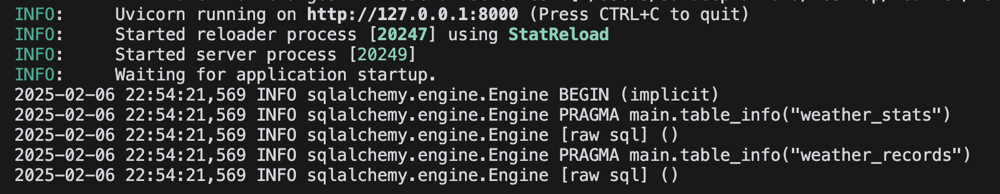
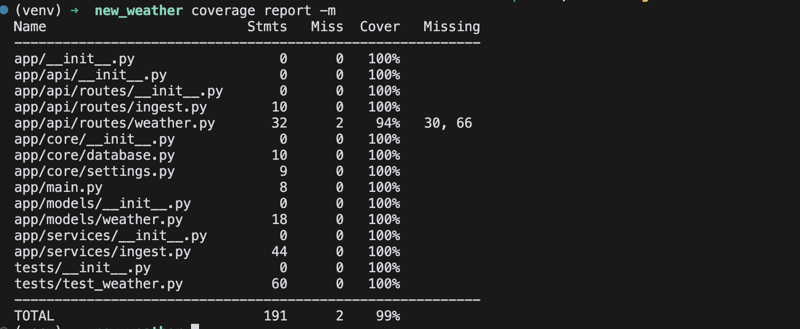
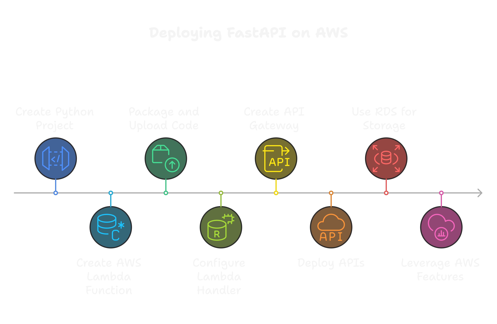
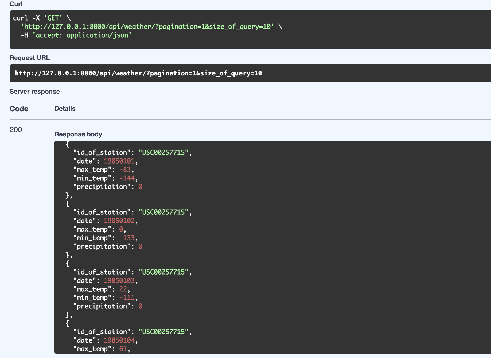
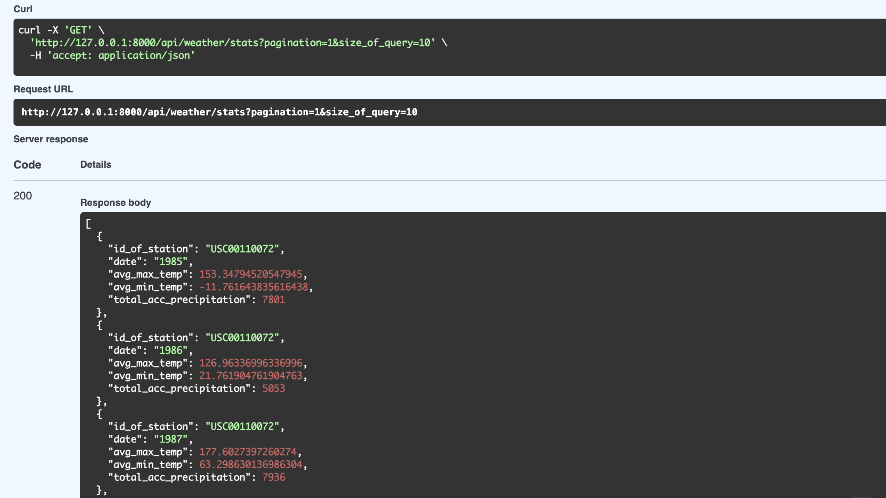
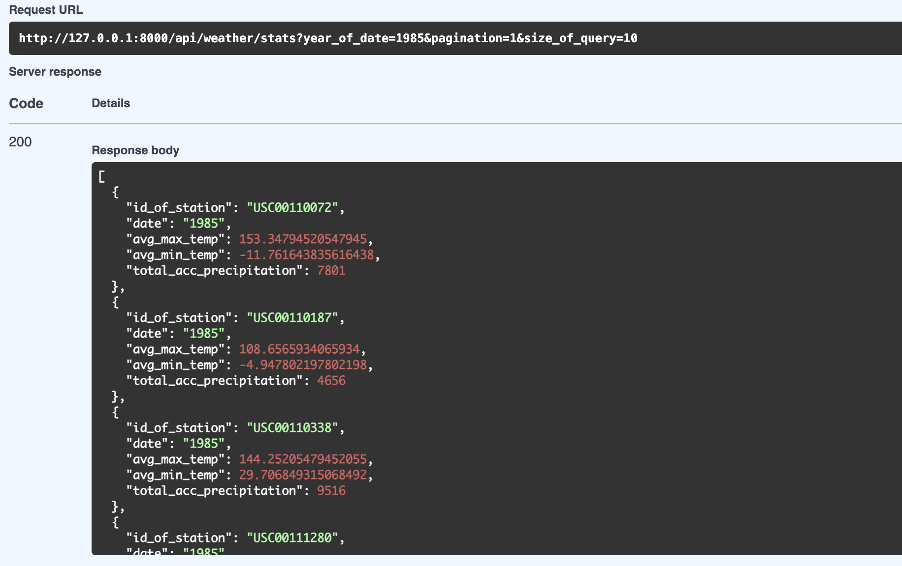
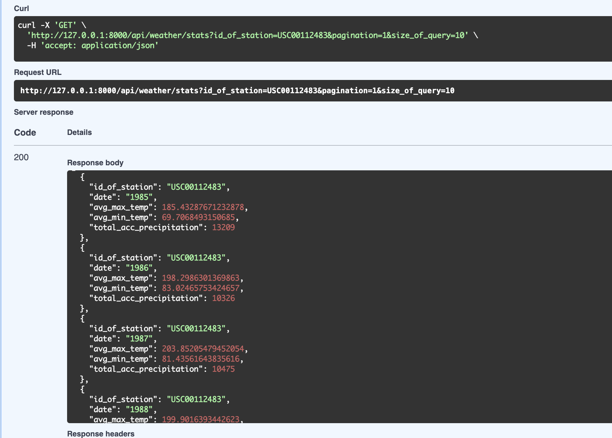
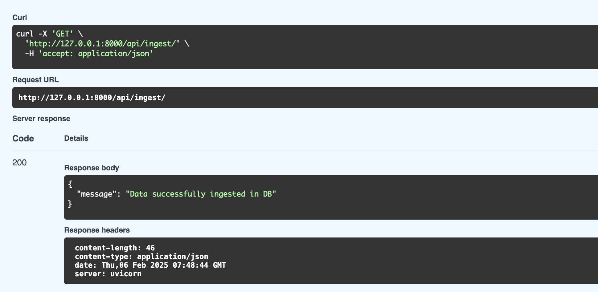

# Weather API (FastAPI Framework)

This API provides weather data and statistics via API endpoints.

## Available Endpoints

- `/api/ingest` - Ingests weather data to DB
- `/api/weather` - Retrieves weather data
- `/api/weather/stats` - Provides statistics about the data
- `/docs` - Provides documentation using OpenAPI

## Prerequisites

- Python (3.8 or higher)
- Virtualenv
- SQLite
- AWS account (if deploying to AWS)


## Project Structure

```bash
.
├── README.md
├── app
│   ├── api
│   │   └── routes
│   │       ├── ingest.py
│   │       └── weather.py
│   ├── core
│   │   ├── database.py
│   │   └── settings.py
│   ├── main.py
│   ├── models
│   │   └── weather.py
│   └── services
│       └── ingest.py
├── data_ingestion.log
├── requirements.txt
├── tests
│   └── test_weather.py
├── weather.db
├── wx_data
│   ├── USC00110072.txt
|   |   All Files in wx_data are in the same format
│   └── USC00339312.txt
└── yld_data
    └── US_corn_grain_yield.txt


```
## Installation and Usage

### Set up Virtual Environment

1. Create a virtual environment:
```bash
python3 -m venv venv
```

2. Activate the virtual environment:
- Windows:
```bash
venv\Scripts\activate
```
- Linux/Mac:
```bash
source venv/bin/activate
```

3. Install dependencies:
```bash
pip install -r requirements.txt
```

### Run the Server

Start the development server:
```bash
uvicorn app.main:app --reload
```


### Access API Endpoints

- Ingest Records: http://127.0.0.1:8000/api/ingest/
- Weather Records: http://127.0.0.1:8000/api/weather/
- Weather Stats: http://127.0.0.1:8000/api/weather/stats
- API Documentation: http://127.0.0.1:8000/docs

## Testing

Run tests with coverage:
```bash
python3 -m coverage run -m pytest tests/test_weather.py
```

Generate coverage report:
```bash
coverage report -m
```

## Cloud Deployment (AWS)

1. Create a Python project with an app.py file containing the FastAPI application code
2. Create a new AWS Lambda function with Python 3.8+ runtime
3. Package code and dependencies as a ZIP file and upload to AWS Lambda
4. Configure the Lambda handler function
5. Create an API Gateway (REST API or HTTP API) integrated with Lambda
6. Deploy APIs to a public endpoint
7. Use RDS for data storage

## Notes

When deploying to AWS, you can leverage:
- Auto-scaling and load balancing for scalability
- AWS security features for protecting the API

### AWS Pipline Workflow

## API Screenshots

### Weather Records


### Statistical Data


### Year-based Statistics


### Station-based Statistics


### Data Ingestion


